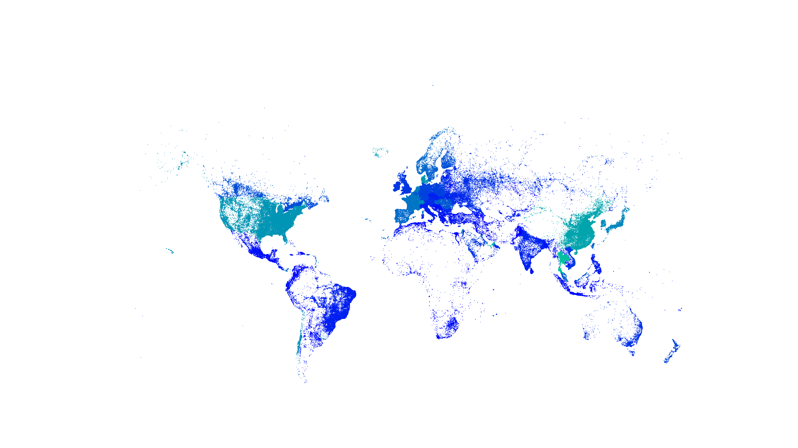

# DNN моделирование на основе данных производительности сети Ookla

В рамках данной работы анализируется возможность по показателям производительности сети определять уровень экономического развития, характерного конкрентному наблюдению.

* prepare.ipynb - загрузка и подготовка данных;
* visual.ipynb - предварительная визуализация данных;
* keras_* - разные варианты построения моделей, в зависимости от данных:
  * \*\_fixed_* - на основе данных фиксированной широкополосной сети;
  * \*\_mobile_* - на основе данных мобильной широкополосной сети;
  * *_merged - на основе исходной выборки;
  * *_light - на основе агрегированной до масштаба стран выборки.





## Наборы данных

Для проведения исследования были задействованы следующие наборы данных:
* **Ookla** - большие данные о производительности сети по всему миру, включающая показатели:
  * `avg_d_kbps` - средняя скорость скачивания сети, кб/сек;
  * `avg_u_kbps` - средняя скорость загрузки сети, кб/сек;
  * `avg_lat_ms` - средняя задержка сети, сек;
  * `tests` - количество проведённых тестов сети;
  * `devices` - количество использованных устройств.
* **IMF** - данные об экономическом состоянии, включающие показатели:
  * `iso_a3` - уникальный код страны;
  * `PPPPC` - ВВП на душу населения - общая стоимость конечных товаров и услуг, произведенных в стране в пересчете на ППС, деленная на среднюю численность населения;
  * `PCPIEPCH` - процентный прирост инфляции в стране;
  * `countries` - наименование страны.
* **NaturalEarth** - пространственные данные административных делений.


## Зависимости

Для работы ноутбуков необходимо выполнить следующий код в среде conda:
```
pip install tensorflow==2.12.*
conda install -c conda-forge geopandas
conda install -c conda-forge pyogrio
```

Доступна поддержка GPU, [подробнее...](https://www.tensorflow.org/install/pip)
